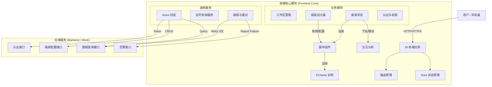

# BI 报表系统 (BI Reporting System)

## 📖 项目简介

这是一个基于 **Vue 2.x** + **Quasar 1.x** + **ECharts 5.x** 的企业级 BI 报表系统。该系统旨在提供灵活的报表设计能力、高性能的实时数据展示以及精细化的权限管理，支持多团队协作（工作区模式）。

核心目标是让用户能够通过简单的拖拽配置生成可视化的数据大屏，并支持实时监控和交互分析（下钻、联动）。

## 🛠 技术栈

- **前端框架**: Vue 2.x
- **UI 组件库**: Quasar Framework 1.x (Material Design)
- **图表库**: ECharts 5.x
- **HTTP 请求**: Axios (封装拦截器实现自动重试与错误处理)
- **状态管理**: Vuex
- **路由**: Vue Router
- **构建工具**: Webpack (Quasar CLI)
- **Mock 数据**: Mock.js (开发阶段全接口 Mock)

## 🏗 系统架构图



## 🧩 模块概览

系统主要分为以下五个核心功能模块，详细设计文档请参考 `design/` 目录：

### 1. [工作区管理 (Workspace)](design/workspace/requirements.md)
- **定位**: 多团队协作的顶层容器。
- **功能**: 创建工作区、管理成员、分配角色（超管、访客等）、用户组管理。
- **API**: `/workspaces`

### 2. [报表设计器 (Report Designer)](design/report_designer/requirements.md)
- **定位**: 核心生产工具。
- **功能**: 
  - 画布自由布局/栅格布局。
  - 图表组件拖拽与配置（大小、样式、数据源）。
  - **自适应缩放**: 基于 CSS `transform: scale` 的高性能缩放方案。
- **API**: `/reports` (CRUD)

### 3. [报表浏览 (Report Viewer)](design/report_viewer/requirements.md)
- **定位**: 数据消费端。
- **功能**:
  - **高性能加载**: 骨架屏优先 + 组件独立并发请求。
  - **实时性**: 定时轮询后端状态，支持增量刷新。
  - **交互**: 全局过滤、图表点击下钻 (Drill-down)。
- **API**: `/reports/{id}/layout`, `/data/query`

### 4. [认证与权限 (Auth & RBAC)](design/auth_rbac/requirements.md)
- **定位**: 安全基石。
- **功能**:
  - 用户登录与 Token 管理。
  - **RBAC**: 工作区管理员、报告管理员、编辑者、访客四级角色。
  - **权限申请**: 无权访问时触发申请流程，通知管理员审批。
- **API**: `/auth/login`, `/access-request`

### 5. [容错与告警 (Fault Tolerance)](design/fault_tolerance/requirements.md)
- **定位**: 稳定性保障。
- **功能**:
  - **自动重试**: 接口失败自动重试 3 次（间隔 5s）。
  - **失败兜底**: 重试耗尽后显示友好提示。
  - **异常上报**: 自动调用接口通知报告管理员。

## 📂 项目结构

```
src/
├── api/                # API 接口定义 (按模块拆分)
├── assets/             # 静态资源
├── components/         # 公共组件
│   ├── charts/         # ECharts 封装 (BaseChart.vue)
│   ├── designer/       # 设计器专用组件 (Canvas, ConfigPanel)
│   └── common/         # 通用 UI (Loading, ErrorState)
├── layouts/            # 页面布局 (MainLayout, AuthLayout)
├── mock/               # Mock 数据 (模拟后端接口)
├── pages/              # 页面视图
│   ├── workspace/      # 工作区列表页
│   ├── designer/       # 报表设计页
│   └── viewer/         # 报表浏览页
├── router/             # 路由配置
├── store/              # Vuex 状态管理
├── utils/              # 工具函数 (request.js 拦截器等)
└── App.vue
```

## 🚀 快速开始

### 前置要求
- Node.js >= 12
- Yarn / NPM

### 安装依赖
```bash
npm install
```

### 启动开发环境
```bash
npm run dev
# 将自动启动 Mock 服务
```

### 构建生产环境
```bash
npm run build
```
